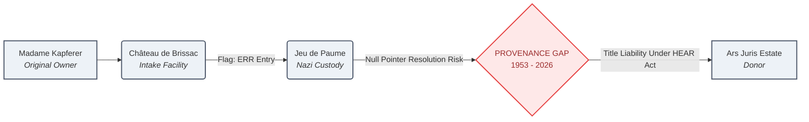

# Forensic Data Architecture: Mapping Opaque Asset Flow

## Project Overview
This repository houses structural data schemas designed to model illicit asset movement, provenance fragmentation, and ultimate beneficial ownership (UBO) networks. The objective is to translate qualitative provenance anomalies into machine-readable network graphs for regulatory compliance, KYC, and anti-money laundering (AML) screening.

## Case Study 1: The Ars Juris Gift & Nazi-Era Provenance
Based on the *Ars Juris* Research Memorandum, this data schema normalizes disparate archival transaction logs into an entity-resolution model. It tracks the physical migration of Pierre Bonnard’s *Reclining Woman on Bed* (1897) through conflicting Nazi confiscation registries (ERR Database) and post-war custodial gaps.

### Entity Relationship Model (Relational Schema)

| Table Name | Primary Key | Attributes / Metadata Captured | Foreign Keys |
| :--- | :--- | :--- | :--- |
| **Asset_Registry** | `Asset_ID` | Title, Artist, Creation_Year, Catalogue_Raisonné_Status | `Provenance_ID` |
| **Entity_Registry**| `Entity_ID` | Entity_Name, Entity_Type (Individual/State/Shell) | `Location_ID` |
| **Custody_Event**  | `Event_ID` | Event_Type (Looting/Sale/Gift), Date, Document_Source | `Asset_ID`, `Source_Entity_ID`, `Target_Entity_ID` |
| **Legal_Risk_Log** | `Risk_ID` | Statutory_Framework (HEAR Act/CPIA), Claim_Window_Status | `Asset_ID` |

## System Visualization Flowchart

## Algorithmic Logic & Red Flag Diagnostics
The data model translates historical text documents into directed edges to calculate structural risk metrics:

